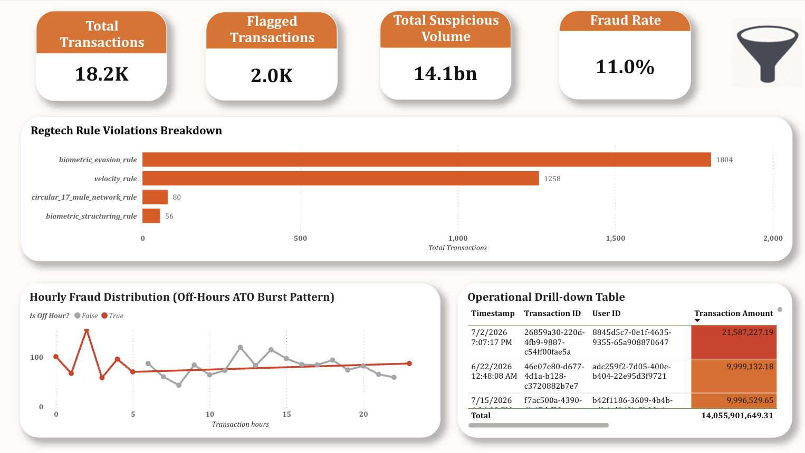

# 🛡️ Walley Risk Fraud Platform: End-to-End Rule-Based RegTech & Fraud Detection Pipeline


An end-to-end Financial Risk & AML analytics pipeline built with **PostgreSQL, Python, and SQL**, visualized through an interactive **Power BI Executive Cockpit**. The platform ingests, cleans, engineers risk features, and scans synthetic transaction data against Vietnamese State Bank (SBV) compliance rules — **Decision 2345** (biometric verification thresholds), **Circular 17/2024/TT-NHNN** (mule account monitoring), and **FATF guidelines** (high-risk country / cross-border screening) — to detect **Account Takeover (ATO)**, **Biometric Evasion/Structuring**, **Impossible Travel**, **Cross-Border Fraud**, and **Mule Account Networks**.

> 📌 **Note:** All transaction, user, beneficiary, and device authentication data in this project is synthetically generated (via Python/Faker-style logic and NumPy) to simulate realistic fraud patterns for portfolio and demonstration purposes. No real financial data is used.

---

## 📸 Dashboard Preview



*4-zone executive cockpit: KPI summary, RegTech rule breakdown, temporal fraud trends, and incident drill-down table.*

🔗 **[Explore the Interactive Power BI Dashboard →](https://app.powerbi.com/groups/me/reports/4363c137-59b2-4ef5-9011-106b53b4bfa6/b668eb87d8dc89ab4cc1?experience=power-bi&bookmarkGuid=3d38567bb8557ac59445)**

---

## 🎯 Business Problem

With the rapid growth of digital banking and e-wallets in Vietnam, financial institutions face increasingly sophisticated, high-velocity fraud vectors. This platform was built to answer six core risk and compliance questions:

1. **Biometric Evasion** — How many transactions are structured between 9,000,000–9,999,999 VND to intentionally bypass mandatory biometric authentication (Decision 2345) on transfers to new or high-risk accounts?
2. **Biometric Structuring (Layered)** — Of those structured transactions, how many are additionally routed to FATF-flagged high-risk countries, indicating a deliberate layering attempt rather than incidental structuring?
3. **Account Takeover (ATO)** — How can we detect high-velocity transaction bursts (>3 transactions within a 5-minute window) indicating a compromised account?
4. **Impossible Travel** — Can we detect an account being accessed from a location physically inconsistent with its immediately preceding login, shortly before a high-value transaction — a strong behavioral signal of session hijacking?
5. **Cross-Border Fraud** — How many transactions route through FATF-sanctioned or high-risk merchant countries above a materiality threshold?
6. **Mule Account Networks** — How do we identify accounts that rapidly aggregate funds from multiple victims (≥4 unique senders within 1 hour), as mandated under Circular 17?

A parallel, ongoing question — **Data Quality** — runs underneath all of the above: how do we enforce data quality (DAMA standards) across messy transactional records before they feed the rules engine and Risk Dashboards?

---

## 🔑 Key Findings

From a cleaned dataset of **18,164 transactions**, the RegTech rules engine — now spanning **six rules** — flagged **~2,000 suspicious transactions** (**~11.0%** flag rate).

| Risk Rule | Triggered Count | What It Means |
|---|---|---|
| `biometric_evasion_rule` | 1,804 | **Primary risk vector.** Transfers of 9M–9.99M VND to newly created beneficiaries, structured just under the 10M VND biometric verification threshold. |
| `velocity_rule` | 1,258 | Rapid-fire transactions (>3 within 5 minutes), consistent with automated cash-out following account compromise. Notably elevated between 1–4 AM. |
| `circular_17_mule_network_rule` | 80 | Accounts receiving funds from ≥4 distinct senders within 1 hour — flagged 8 distinct organized mule rings, all with account age <15 days. |
| `biometric_structuring_rule` | 56 | Cross-border FATF-flagged transactions combined with biometric evasion, indicating layered laundering attempts. |
| `cross_border_fraud_rule` | — | Transactions routed through FATF-sanctioned/high-risk merchant countries (North Korea, Iran, Syria, Myanmar, Russia) above a 1,000,000 VND materiality threshold. |
| `impossible_travel_rule` | — | High-value transactions (≥10M VND) preceded by a login from a location physically inconsistent with the prior login within a 2-hour window — a direct behavioral signature of the engineered ATO attack scenario (see [Synthetic Data Generation](#synthetic-data-generation-methodology) below). |

*Note: individual rule counts sum to more than total flagged transactions because some transactions trigger multiple rules concurrently. Exact triggered counts for `cross_border_fraud_rule` and `impossible_travel_rule` are produced by the verification query in `sql/04_regtech_rules.sql` and vary slightly run-to-run since the underlying data is regenerated stochastically.*

> 🐍 The full detection pipeline runs in PostgreSQL for production scale. A parallel **Pandas-based ETL notebook** (`python/pandas_etl_demo.ipynb`) replicates the core cleaning and feature-engineering logic step-for-step, with SQL-to-Pandas equivalents documented inline — see [Technical Documentation](docs/TechnicalDocumentation.md#pandas-etl-layer) for details.

---

## 🧪 Synthetic Data Generation Methodology

Rather than assigning random fraud labels to random transactions, `python/generate_data.py` builds a **realistic organic transaction stream** and then **deliberately injects two named, engineered attack scenarios** with full ground-truth labels — so the rules engine is tested against patterns that mirror how these attacks actually unfold, not arbitrary noise.

**Realistic amount modeling:** transaction amounts are drawn from a **log-normal distribution** (rather than a uniform one) to reflect the real-world skew of financial transaction sizes — most transactions are small, with a long tail of larger ones. A deliberate third peak is layered in at 9,000,000–9,999,999 VND to simulate genuine SBV Decision 2345 structuring behavior at realistic frequency.

**Scenario A — ATO Night Burst Attack (25 injected sequences):** each sequence simulates a compromised account end-to-end: an "impossible travel" login event from a Russian IP (VPN and emulator flags set, device fingerprint inconsistent with the user's legitimate device history) immediately followed by four rapid transactions to a mule beneficiary within a ~2-minute window. Every transaction in this scenario is tagged `is_ground_truth_fraud = TRUE`, with a `chargeback_reported_at` timestamp lagging 3–15 days behind — modeling the real-world delay between fraud occurring and a victim reporting it.

**Scenario B — NAPAS Interbank Mule Rapid Drain (8 mule rings):** each of 8 designated mule beneficiary accounts receives 8 transactions from distinct victim users within a short rolling window, simulating the fund-aggregation pattern Circular 17 is designed to catch. These are also fully labeled as ground-truth fraud.

This design means the dataset carries genuine **ground-truth fraud labels** (`is_ground_truth_fraud`, `chargeback_reported_at`) that the current rule set does not yet formally score against — see [Future Work](#-scope--roadmap) below.

---

## 💡 Recommendations

| Priority | Finding | Recommended Action |
|---|---|---|
| Immediate | 1,804 transactions evaded biometric checks by staying under 10M VND | Require step-up 2FA/OTP verification for first-time transfers to new beneficiaries, regardless of amount |
| Operational | 80 transactions tied to 8 mule rings | Auto-trigger a 24-hour debit block on any account flagged by `circular_17_mule_network_rule`, routed to AML review |
| Product/Security | Velocity bursts show notable concentration 1–4 AM | Cap transfers at 3 per 5-minute window during off-hours; require re-authentication beyond that |
| Product/Security | Impossible-travel logins precede high-value transactions in engineered ATO scenarios | Require step-up re-authentication whenever a login's geolocation is inconsistent with the immediately preceding session, ahead of any transaction ≥10M VND |

Full reasoning and supporting evidence for each recommendation: see [Technical Documentation](docs/TechnicalDocumentation.md#recommendations).

---

## 🧰 Tech Stack

`PostgreSQL` · `Python (NumPy, pandas, psycopg2, uuid)` · `SQL Window Functions` · `Power BI` · `DAMA Data Quality Framework` · `Jupyter` · `LibreOffice Basic (VBA-compatible)`

---

## 🚀 Quick Start

```bash
# 1. Clone and install dependencies
git clone https://github.com/ericgalbarn/walley_risk_fraud_platform.git
cd walley_risk_fraud_platform
pip install -r requirements.txt

# 2. Create the database
createdb walley_risk_db

# 3. Run the pipeline in order
psql -U postgres -d walley_risk_db -f sql/01_create_tables.sql
python python/generate_data.py
psql -U postgres -d walley_risk_db -f sql/02_feature_engineering.sql
psql -U postgres -d walley_risk_db -f sql/03_data_cleaning.sql
psql -U postgres -d walley_risk_db -f sql/04_regtech_rules.sql
psql -U postgres -d walley_risk_db -f sql/05_create_views.sql

# 4. Connect Power BI (or Tableau/Metabase) to localhost:5432/walley_risk_db
#    Import views: vw_dashboard_fraud_summary, vw_dashboard_rule_breakdown
```

📖 **Full step-by-step guide with expected outputs:** [docs/TechnicalDocumentation.md](docs/TechnicalDocumentation.md#execution-guide)

---

## 📁 Repository Structure

```
walley-risk-fraud-platform/
│
├── README.md                        # You are here
├── LICENSE                          # MIT License
├── requirements.txt                 # Python dependencies
│
├── docs/
│   └── TechnicalDocumentation.md    # Full methodology, code walkthroughs, data dictionary
│
├── screenshots/
│   ├── 01_dashboard_preview.png                       # Power BI cockpit preview
│   ├── 02_cleaning_verification.png                    # Data cleaning verification output
│   ├── 03_regtech_verification.png                     # RegTech rule trigger verification output
│   ├── 04_verifying_velocity_triggered_off_hours.png   # Velocity rule / off-hours cross-check
│   ├── 05_verifying_biometric_evasion_transaction.png  # Biometric evasion rule verification
│   └── 06_verifying_remote_transactions_off_hours.png  # Geolocation / off-hours cross-check
│
├── python/
│   ├── generate_data.py             # Synthetic raw event data generator (log-normal amounts, engineered attack scenarios)
│   └── pandas_etl_demo.ipynb        # Pandas ETL layer (mirrors SQL cleaning/feature logic)
│
├── vba/
│   └── FormatFlaggedTransactions.bas    # VBA macro: board-ready risk report from ETL output
└── sql/
    ├── 01_create_tables.sql                          # Schema definition
    ├── 02_feature_engineering.sql                     # Spatial/temporal/behavioral/velocity feature engineering
    ├── 03_data_cleaning.sql                           # DAMA data quality pipeline
    ├── 04_regtech_rules.sql                           # Six-rule RegTech engine (SBV 2345, Circular 17, FATF)
    ├── 05_create_views.sql                            # BI-ready data mart views
    ├── 06_verifying_velocity_triggered_off_hours.sql  # Verification query for velocity/off-hours insight
    ├── 07_verifying_biometric_evasion_transaction.sql # Verification query for biometric evasion insight
    └── 08_verifying_remote_transaction_off_hours.sql  # Verification query for geolocation/off-hours insight
```

---

## 🔭 Scope & Roadmap

This project is intentionally scoped as a **rules-based Data Analytics pipeline** — it demonstrates SQL engineering, feature construction, data quality enforcement, and BI storytelling. It is **not** presented as a production fraud-prevention system.

The schema already provisions several fields that this phase deliberately does **not** yet use, reserved for a future ML/operational-review phase:
- `fraud_score`, `final_decision`, `status`, `reviewed_by`, `reviewed_at` on `transactions` — an operational decision/review workflow (pending → reviewed → decision) to be driven by a future scoring model rather than static rules.
- `kyc_status`, `risk_tier`, `wallet_balance` on `users`, and `is_mule_flagged` on `beneficiaries` — profile-level risk attributes intended as model features once ML scoring is introduced.
- `is_ground_truth_fraud` and `chargeback_reported_at` on `transactions` — genuine ground-truth fraud labels are already generated (see [Synthetic Data Generation](#-synthetic-data-generation-methodology)) but are not yet formally scored against the current rule set; a future phase would measure rule precision/recall against these labels before layering on ML.

Planned next phases:
- **ML-based anomaly scoring** to replace static thresholds, which are inherently evadable once known — trained against the ground-truth labels already present in the dataset
- **Graph-based network analysis** for deeper mule-ring detection beyond simple sender-count thresholds
- **Case management workflow** for analyst triage and SAR filing, using the already-provisioned `status`/`final_decision`/`reviewed_by` fields

See [Limitations & Assumptions](docs/TechnicalDocumentation.md#limitations--assumptions) for full detail.

---

## License

This project is licensed under the **MIT License**.

- **Code (.py, .sql):** Free to modify, distribute, and use for commercial or private purposes.
- **Power BI (.pbix):** Free to download, view, and reuse the data model and report layouts.

Attribution appreciated — please link back to this repository if you use this work.