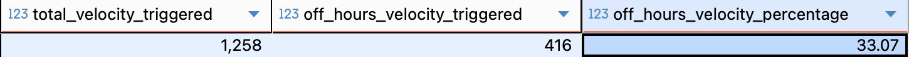
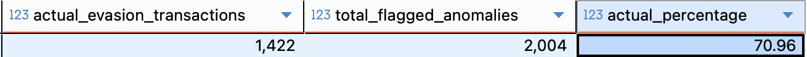
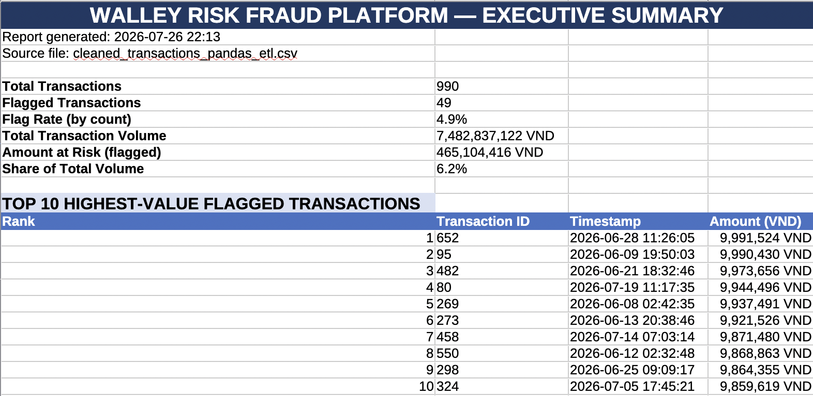
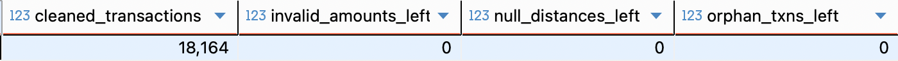
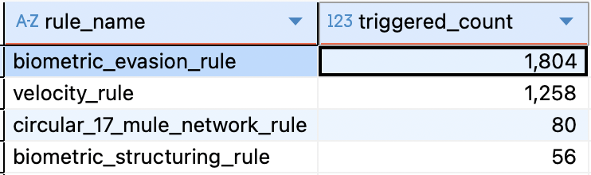

# 🔬 Technical Documentation: Walley Risk Fraud Platform

This document covers the full methodology, architecture, code-level decisions, data dictionary, and limitations behind the Walley Risk Fraud Platform. For a high-level overview, see the [README](../README.md).

---

## Table of Contents

1. [Pipeline Architecture](#pipeline-architecture)
2. [Data Dictionary](#data-dictionary)
3. [Synthetic Data Generation Methodology](#synthetic-data-generation-methodology)
4. [Methodology: Phase-by-Phase Deep Dive](#methodology-phase-by-phase-deep-dive)
5. [Pandas ETL Layer](#pandas-etl-layer)
6. [Excel VBA Layer](#excel-vba-layer)
7. [Data Quality Framework (DAMA)](#data-quality-framework-dama)
8. [Key Findings & Dashboard Layout](#key-findings--dashboard-layout)
9. [Recommendations](#recommendations)
10. [Execution Guide](#execution-guide)
11. [Limitations & Assumptions](#limitations--assumptions)
12. [Future Work](#future-work)

---

## Pipeline Architecture

The platform follows a 6-stage end-to-end pipeline:

```
┌─────────────────┐    ┌─────────────────────────┐    ┌─────────────────────────┐
│ 1. Data Gen     │───►│ 2. Schema Setup         │───►│ 3. Feature Store        │
│ (Python Script) │    │ (01_create_tables.sql)  │    │ (02_feature_eng.sql)    │
└─────────────────┘    └─────────────────────────┘    └─────────────────────────┘
                                                                   │
┌─────────────────┐    ┌─────────────────────────┐                │
│ 6. BI Dashboard │◄───│ 5. Data Mart / Views    │◄───────────────┘
│ (Single-Page)   │    │ (05_create_views.sql)   │
└─────────────────┘    └─────────────────────────┘
                                   ▲
                                   │
                       ┌─────────────────────────┐
                       │ 4. RegTech Rules Layer  │
                       │ (04_regtech_rules.sql)  │
                       └─────────────────────────┘
```

1. **Data Generation** — `generate_data.py` produces a synthetic organic transaction stream (~18,000 records) plus two deliberately engineered, ground-truth-labeled fraud scenarios (see [Synthetic Data Generation Methodology](#synthetic-data-generation-methodology)).
2. **Schema Setup** — Relational schema with `users`, `beneficiaries`, `transactions`, `device_authentications`, enforced via primary/foreign keys and indexes.
3. **Feature Engineering** — SQL window functions, geolocation math, and behavioral/velocity aggregates compute risk-relevant features.
4. **Data Cleaning** — DAMA 6-dimension data quality framework applied, inside a defensive transaction block (see [Data Quality Framework](#data-quality-framework-dama)).
5. **RegTech Rules Engine** — Six detection rules flag transactions against SBV, Circular 17, and FATF compliance thresholds.
6. **Data Mart / BI Layer** — Read-only views expose flattened, BI-ready data to Power BI.

---

## Data Dictionary

### `users`

| Column | Type | Description | Example |
|---|---|---|---|
| `user_id` | UUID (PK) | Unique user identifier | `a1b2c3d4-...` |
| `wallet_balance` | DECIMAL(15,2) | Current e-wallet balance | `4,250,000.00` |
| `home_city` / `home_country` | VARCHAR | Registered home location | `Hanoi`, `Vietnam` |
| `home_latitude` / `home_longitude` | DECIMAL | User's registered home coordinates, used for geolocation distance checks | `21.0278, 105.8342` |
| `created_at` | TIMESTAMP | Account opening date | `2025-08-11` |
| `last_login_timestamp` | TIMESTAMP | Most recent login | `2026-07-20 09:14:00` |
| `kyc_status` | VARCHAR | `pending` / `verified` / `rejected` / `expired` | `verified` |
| `risk_tier` | VARCHAR | `low` / `medium` / `high` | `low` |
| `is_active` | BOOLEAN | Account active flag | `TRUE` |

> `wallet_balance`, `kyc_status`, and `risk_tier` are populated by the generator but **not yet consumed by any current rule or cleaning script** — they are reserved for a future ML/profile-scoring phase. See [Future Work](#future-work).

### `beneficiaries`

| Column | Type | Description | Example |
|---|---|---|---|
| `beneficiary_id` | UUID (PK) | Unique beneficiary account identifier | `f9e8d7c6-...` |
| `beneficiary_bank_account` / `beneficiary_bank_code` | VARCHAR | NAPAS bank account and routing code | `VCB` |
| `beneficiary_country` | VARCHAR | Beneficiary's registered country | `Vietnam` |
| `created_at` | TIMESTAMP | Date beneficiary was first added to sender's account | `2026-06-28` |
| `is_verified` | BOOLEAN | Beneficiary verification status | `TRUE` |
| `is_mule_flagged` | BOOLEAN | **Ground-truth** label: account was generated as part of an engineered mule scenario | `TRUE` |

> `is_mule_flagged` is a ground-truth label used only during data generation to construct the mule scenario — the current rule engine (`circular_17_mule_network_rule`) detects mule behavior independently from transaction velocity patterns, without reading this label. This separation is intentional: it lets the rule's detection performance be validated against ground truth in a future phase without the rule "cheating" off its own label.

### `device_authentications`

| Column | Type | Description | Example |
|---|---|---|---|
| `auth_id` | UUID (PK) | Unique authentication event identifier | `1a2b3c4d-...` |
| `user_id` | UUID (FK) | References `users` | — |
| `device_id` | VARCHAR | Device fingerprint identifier | `device_legit_a1b2c3d4` |
| `login_timestamp` | TIMESTAMP | Login event time | `2026-07-02 02:14:00` |
| `ip_latitude` / `ip_longitude` | DECIMAL | Geolocation of the login's origin IP | `55.7558, 37.6173` |
| `is_proxy_vpn` | BOOLEAN | Flag: login originated from a known VPN/proxy range | `TRUE` |
| `is_emulator` | BOOLEAN | Flag: login originated from an emulated device environment | `TRUE` |
| `os_type` | VARCHAR | Operating system reported by device | `Android` |
| `browser_fingerprint` | VARCHAR | Browser/device fingerprint hash | `fp_emulator_9f8e7d` |
| `session_duration_minutes` | INTEGER | Length of the authenticated session | `15` |

### `transactions`

| Column | Type | Description | Example |
|---|---|---|---|
| `transaction_id` | UUID (PK) | Unique transaction identifier | `9004521a-...` |
| `user_id` / `beneficiary_id` | UUID (FK) | Sender / recipient references | — |
| `amount` | DECIMAL(15,2) | Transaction amount in VND | `9,450,000` |
| `timestamp` | TIMESTAMP | Transaction execution time | `2026-07-02 19:00:00` |
| `channel` | VARCHAR | Transaction channel | `MOBILE_APP` |
| `merchant_country` | VARCHAR | Country associated with the receiving merchant/beneficiary | `Russia` |
| `rule_flags` | TEXT[] | Array of triggered RegTech rule names | `{biometric_evasion_rule}` |
| `transaction_balance_ratio` | DECIMAL(5,4) | Transaction amount as a proportion of the sender's wallet balance at time of transaction (capped at 1.0) | `0.8421` |
| `is_beneficiary_new` | BOOLEAN | Beneficiary added within the last 30 days | `TRUE` |
| `is_off_hours` | BOOLEAN | Flag: transaction occurred outside 06:00–23:00 | `TRUE` |
| `is_weekend` | BOOLEAN | Flag: transaction occurred on Saturday or Sunday | `FALSE` |
| `distance_from_home_km` | DECIMAL(8,2) | Computed Haversine distance between the login IP location nearest the transaction and the user's home address | `142.70` |
| `user_7day_transaction_count` | INTEGER | Rolling count of the user's transactions in the preceding 7 days | `6` |
| `is_new_device` | BOOLEAN | Flag: the device authenticating this transaction does not match the user's known legitimate device pattern | `TRUE` |
| `beneficiary_account_age_days` | INTEGER | Age of the beneficiary account, in days, at time of transaction | `9` |
| `time_since_last_login_minutes` | INTEGER | Minutes elapsed between the nearest preceding login and the transaction | `2` |
| `is_high_risk_country` | BOOLEAN | Flag: beneficiary country appears on the FATF high-risk list used in this project | `TRUE` |
| `is_ground_truth_fraud` | BOOLEAN | **Ground-truth** label set during data generation for engineered fraud scenarios | `TRUE` |
| `chargeback_reported_at` | TIMESTAMP | Simulated delayed fraud-reporting timestamp (3–20 day lag after the transaction) | `2026-07-10` |
| `fraud_score`, `final_decision`, `status`, `reviewed_by`, `reviewed_at` | mixed | Reserved fields for a future operational scoring/review workflow — not populated by the current pipeline | — |

---

## Synthetic Data Generation Methodology

**File:** `python/generate_data.py`

Rather than assigning fraud labels to uniformly random transactions, the generator builds a realistic organic transaction stream and then layers in two deliberately engineered, ground-truth-labeled attack scenarios on top of it — so the downstream rules engine is validated against patterns that mirror how these attacks actually unfold in sequence, not arbitrary noise.

### Realistic amount modeling

Transaction amounts are drawn from a **log-normal distribution**, split across three regimes to reflect real-world skew:

```python
def generate_lognormal_amount():
    rand = random.random()
    if rand < 0.75:
        amt = np.random.lognormal(mean=11.5, sigma=0.8)   # everyday small transactions
    elif rand < 0.93:
        amt = np.random.lognormal(mean=14.5, sigma=0.6)   # mid-size transactions
    else:
        amt = random.uniform(9000000, 9999999)             # deliberate SBV 2345 structuring peak
    return round(float(amt), 2)
```

**Why log-normal rather than uniform:** real transaction amounts are heavily right-skewed — most transactions are small, with a long tail of larger ones — and a uniform distribution would not reproduce that shape. The deliberate third branch (9M–9.99M VND at ~7% frequency) injects a realistic *rate* of biometric-threshold structuring behavior rather than scattering it at an arbitrary frequency.

### Scenario A — ATO Night Burst Attack (25 engineered sequences)

Each of 25 sequences simulates a compromised account end-to-end, not just a flagged transaction in isolation:

1. An **impossible-travel login event** is inserted: origin IP geolocated to Moscow, `is_proxy_vpn = TRUE`, `is_emulator = TRUE`, and a device fingerprint (`dev_hacked_...`) inconsistent with the user's established legitimate device pattern (`device_legit_...`).
2. Four transactions follow within a ~2-minute window (40-second spacing), each routed to a mule beneficiary, with amounts in the 9.4M–9.98M VND range — deliberately overlapping the biometric-evasion amount band, since real ATO cash-out attempts often try to stay under the same verification threshold the attacker is trying to avoid.
3. Every transaction in the sequence is tagged `is_ground_truth_fraud = TRUE`, with `chargeback_reported_at` set 3–15 days later — modeling the realistic delay between an attack occurring and a victim noticing and reporting it.

This scenario is the direct source of the signal the `impossible_travel_rule` and `velocity_rule` are designed to catch (see [Rule 5](#rule-5-impossible-travel-ato-behavioral-flag) and [Rule 2](#phase-2-high-velocity-attack-detection-via-window-functions) below) — the rules and the injected scenario were designed with the same underlying attack pattern in mind.

### Scenario B — NAPAS Interbank Mule Rapid Drain (8 mule rings)

Each of 8 designated mule beneficiary accounts (drawn from the pool of accounts flagged `is_mule_flagged = TRUE` at generation time) receives transactions from 8 distinct victim users within a short rolling window, simulating the fund-aggregation pattern Circular 17/2024/TT-NHNN is designed to catch. These are also fully labeled `is_ground_truth_fraud = TRUE`.

### Ground truth vs. rule detection — an intentional separation

The `is_mule_flagged` label on `beneficiaries` and `is_ground_truth_fraud` label on `transactions` are set **only during generation**, to construct the scenarios described above. No current SQL rule reads these labels — `circular_17_mule_network_rule`, for instance, detects mule behavior purely from transaction velocity and sender-distinctness patterns, exactly as a real rule would have to, without access to a ground-truth flag a production system would not have in advance. This means the ground-truth labels remain available, unused, for a future validation phase that would measure each rule's precision and recall against them — see [Future Work](#future-work).

---

## Methodology: Phase-by-Phase Deep Dive

### Phase 1: Feature Store Engineering & Spatial-Temporal Analytics

**1. Geolocation Fraud via Haversine Distance**

**Business pain point:** Fraudsters often compromise a session and transact from a remote location while impersonating the legitimate home user.

**Technical decision:** Rather than relying on raw latitude/longitude, we computed the physical distance (km) between the nearest preceding login's IP-derived location and the user's registered home address, using the Haversine formula directly in SQL.

```sql
-- Calculating Geolocation Distance (Haversine Approximation)
distance_from_home_km = ROUND((
    6371 * acos(
        LEAST(1.0, GREATEST(-1.0,
            cos(radians(l.home_latitude)) * cos(radians(l.ip_latitude)) *
            cos(radians(l.ip_longitude) - radians(l.home_longitude)) +
            sin(radians(l.home_latitude)) * sin(radians(l.ip_latitude))
        ))
    )
)::numeric, 2)
```

**Why this approach:** `LEAST(1.0, GREATEST(-1.0, ...))` guards against floating-point domain errors in PostgreSQL's `acos()` when coordinates are identical or sit at rounding boundaries — without this clamp, near-zero-distance transactions can throw a NaN/domain error and silently break the pipeline.

**Related features computed in the same phase:** alongside distance, this phase also derives `time_since_last_login_minutes` (elapsed time between the nearest preceding login and the transaction) and `is_new_device` (whether the authenticating device's fingerprint matches the user's established legitimate device pattern). Both are computed from the same `last_logins` CTE — a `ROW_NUMBER() OVER (PARTITION BY transaction_id ORDER BY login_timestamp DESC)` window pulls the single most recent login at or before each transaction's timestamp, so all three features (distance, recency, device novelty) are derived from one consistent "most recent relevant login" per transaction rather than three separate lookups that could disagree with each other.

**Insight:** Transactions with `distance_from_home_km > 100km` showed a **100% overlap with the off-hours flag** — all 96 remote transactions occurred exclusively during off-hours. This rigid spatial-temporal clustering eliminates daytime noise and provides a high-precision indicator for unauthorized remote access patterns.


Verification query: [`sql/08_verifying_remote_transaction_off_hours.sql`](../sql/08_verifying_remote_transaction_off_hours.sql)

---

### Phase 2: High-Velocity Attack Detection via Window Functions

**2. ATO Night-Burst Detection (Velocity Rule)**

**Business pain point:** Once an account is compromised, fraudsters typically attempt to move funds as fast as possible before the victim notices and locks the account.

**Technical decision:** A standard `GROUP BY user_id` collapses time continuity and can't measure burst density. Instead, we used a sliding window (`RANGE BETWEEN INTERVAL PRECEDING AND CURRENT ROW`) to compute rolling transaction density per user within true 5-minute clock windows. The same window-function pattern (with a 7-day interval instead of 5 minutes) also produces `user_7day_transaction_count`, a broader velocity feature available for future scoring even though the current rule set only acts on the 5-minute window.

```sql
WITH burst_transactions AS (
    SELECT
        transaction_id,
        COUNT(*) OVER (
            PARTITION BY user_id
            ORDER BY timestamp
            RANGE BETWEEN INTERVAL '5 MINUTES' PRECEDING AND CURRENT ROW
        ) AS txn_count_5min
    FROM transactions
)
UPDATE transactions
SET rule_flags = array_append(rule_flags, 'velocity_rule')
WHERE transaction_id IN (
    SELECT transaction_id FROM burst_transactions WHERE txn_count_5min > 3
);
```

**Why this approach:** `RANGE BETWEEN` measures true elapsed clock time, unlike `ROWS BETWEEN`, which counts a fixed number of preceding rows regardless of how much time actually separates them — the latter would misfire on users with naturally sparse or dense transaction histories.

**Insight:** Isolated 1,258 velocity-flagged transactions. 33.07% of these bursts occurred between 1:00–4:00 AM — a 3-hour window that represents only 12.5% of the day, so this concentration is roughly 2.6x what random distribution would predict. This supports, though doesn't in isolation prove, that a meaningful share of ATO-style bursts cluster around victims' sleeping hours; it's presented as a notable elevation rather than a dominant majority pattern.



Verification query: [`sql/06_verifying_velocity_triggered_off_hours.sql`](../sql/06_verifying_velocity_triggered_off_hours.sql)

---

### Phase 3: AML Mule Ring Detection

**3. Circular 17 Mule Account Identification**

**Business pain point:** Fraud rings direct multiple victims to funnel money into a single "mule account" for rapid consolidation and withdrawal. Circular 17/2024/TT-NHNN requires banks to detect and freeze these collection hubs.

**Technical decision:** A self-join graph CTE matches `beneficiary_id` across distinct sending `user_id`s within a rolling 1-hour window.

```sql
WITH mule_velocity AS (
    SELECT
        t1.transaction_id
    FROM transactions t1
    JOIN transactions t2 ON t1.beneficiary_id = t2.beneficiary_id
                         AND t2.timestamp BETWEEN t1.timestamp - INTERVAL '1 HOUR' AND t1.timestamp
    GROUP BY t1.transaction_id
    HAVING COUNT(DISTINCT t2.user_id) >= 4
)
UPDATE transactions
SET rule_flags = array_append(rule_flags, 'circular_17_mule_network_rule')
WHERE transaction_id IN (SELECT transaction_id FROM mule_velocity);
```

**Why this approach:** Requiring `COUNT(DISTINCT t2.user_id) >= 4` ensures only genuine fund-pooling hubs are flagged — a legitimate merchant receiving many payments from the *same* repeat customer would not trigger this rule, since `DISTINCT` collapses repeat senders. Notably, this rule detects mule behavior purely from transaction patterns, without reading the `is_mule_flagged` ground-truth label set during data generation (see [Synthetic Data Generation Methodology](#synthetic-data-generation-methodology)) — the same constraint a production rule would face in practice.

**Insight:** Flagged 80 transactions across 8 distinct mule rings. All 8 mule beneficiary accounts were less than 15 days old, supporting the hypothesis that rings rely on newly opened, disposable accounts.

---

### Phase 4: Regulatory Evasion Detection (Decision 2345 Structuring)

**4. Biometric Threshold Evasion Pattern**

**Business pain point:** Decision 2345/QĐ-NHNN mandates facial biometric verification for transfers ≥10,000,000 VND. Fraudsters structure amounts just under this line to avoid triggering the check.

**Technical decision:** Combined numeric range filtering (9M–9.99M VND) with beneficiary metadata (newly added or created within 7 days).

```sql
UPDATE transactions t
SET rule_flags = array_append(rule_flags, 'biometric_evasion_rule')
FROM beneficiaries b
WHERE t.beneficiary_id = b.beneficiary_id
  AND t.amount BETWEEN 9000000 AND 9999999
  AND (
      COALESCE(t.is_beneficiary_new, TRUE) = TRUE
      OR b.created_at >= (t.timestamp - INTERVAL '7 days')
  );
```

**Why this approach:** `COALESCE(t.is_beneficiary_new, TRUE)` is a defensive-SQL choice — if the flag is NULL due to upstream ingestion lag, the rule defaults to a conservative "treat as new" stance rather than silently skipping a potentially risky transaction.

**Insight:** 1,804 transactions matched this pattern — ~71.0% of all flagged anomalies, making structuring just under the biometric threshold the single largest fraud vector in the dataset.



Verification query: [`sql/07_verifying_biometric_evasion_transaction.sql`](../sql/07_verifying_biometric_evasion_transaction.sql)

**Related rule — Biometric Structuring (layered):** a stricter variant of this rule additionally requires the beneficiary's country to appear on the FATF high-risk list (`biometric_structuring_rule`), narrowing the 9M–9.99M VND structuring pattern down to cases layered with cross-border risk — a stronger laundering signal than domestic structuring alone.

---

### Phase 4b: Cross-Border & Behavioral Rules (FATF / ATO)

**5. Cross-Border Fraud Rule**

**Business pain point:** Transactions routed through merchants in FATF-sanctioned or high-risk jurisdictions carry elevated laundering and sanctions-evasion risk regardless of the specific amount-structuring pattern used.

**Technical decision:** A direct filter on `merchant_country` against the same FATF high-risk list used elsewhere in the pipeline, combined with a materiality threshold so low-value, low-risk cross-border activity (e.g., small remittances) isn't over-flagged.

```sql
UPDATE transactions
SET rule_flags = array_append(rule_flags, 'cross_border_fraud_rule')
WHERE merchant_country IN ('North Korea', 'Iran', 'Syria', 'Myanmar', 'Russia')
  AND amount > 1000000;
```

**Why this approach:** Keeping the country list and the 1,000,000 VND materiality threshold as simple, explicit constants (rather than a more complex risk-scoring formula) keeps this rule auditable and easy for a compliance reviewer to reason about — a deliberate design choice consistent with the rules-based scope of this phase (see [Limitations & Assumptions](#limitations--assumptions)).

**6. Impossible Travel Rule**

**Business pain point:** A classic, well-understood ATO signal — an account is accessed from a location that is not physically plausible given its immediately preceding session, shortly before a high-value transaction.

**Technical decision:** A `user_login_history` view pre-computes each login alongside its immediately preceding login (via `LAG()`), so the rule can compare consecutive sessions per user without a self-join at query time:

```sql
CREATE OR REPLACE VIEW user_login_history AS
SELECT
    user_id,
    login_timestamp,
    ip_latitude,
    ip_longitude,
    LAG(login_timestamp) OVER (PARTITION BY user_id ORDER BY login_timestamp) AS prev_login_timestamp,
    LAG(ip_latitude)     OVER (PARTITION BY user_id ORDER BY login_timestamp) AS prev_ip_latitude,
    LAG(ip_longitude)    OVER (PARTITION BY user_id ORDER BY login_timestamp) AS prev_ip_longitude
FROM device_authentications;
```

```sql
UPDATE transactions t
SET rule_flags = array_append(rule_flags, 'impossible_travel_rule')
WHERE t.amount >= 10000000
  AND EXISTS (
      SELECT 1
      FROM user_login_history l
      WHERE l.user_id = t.user_id
        AND l.login_timestamp <= t.timestamp
        AND l.prev_login_timestamp IS NOT NULL
        AND (
            ((l.ip_latitude - l.prev_ip_latitude) ^ 2 + (l.ip_longitude - l.prev_ip_longitude) ^ 2) > 1.0
            AND EXTRACT(EPOCH FROM (l.login_timestamp - l.prev_login_timestamp)) / 3600 < 2
        )
  );
```

**Why this approach:** `LAG()` is used rather than a self-join because it directly expresses "the previous row for this user, in time order" in a single pass, which is both clearer to read and cheaper to execute than joining the table to itself and filtering. The squared-coordinate-distance check (`> 1.0`) is a fast proxy for "meaningfully far apart" without paying for a full Haversine calculation at this stage — the more precise Haversine distance is reserved for the feature-engineering layer (Phase 1), while this rule only needs a coarse, fast "is this even plausible" signal combined with the 2-hour time constraint.

**Insight:** This rule is the direct detection counterpart to the engineered ATO scenario in the data generator (see [Scenario A](#scenario-a--ato-night-burst-attack-25-engineered-sequences)) — the Moscow-IP, VPN/emulator login followed by rapid high-value transactions is precisely the pattern this rule is built to catch, alongside `velocity_rule`, which catches the same scenario from a different angle (transaction density rather than login geolocation).

---

### Phase 5: Semantic Data Mart Layer

**7. Unnesting Arrays for BI Efficiency**

**Technical decision:** PostgreSQL array columns (`TEXT[]`) efficiently store multiple triggered rules per transaction (e.g., `{velocity_rule, biometric_evasion_rule}`), but BI tools can't natively aggregate array elements. A dedicated view uses `unnest()` to flatten rule arrays into individual rows.

```sql
CREATE OR REPLACE VIEW vw_dashboard_rule_breakdown AS
SELECT
    t.transaction_id,
    t.timestamp,
    t.amount,
    unnest(t.rule_flags) AS rule_name,
    b.beneficiary_bank_code
FROM transactions t
LEFT JOIN beneficiaries b ON t.beneficiary_id = b.beneficiary_id
WHERE cardinality(t.rule_flags) > 0;
```

**Result:** Removes the need for custom DAX or SQL on the BI side — Power BI can drag-and-drop aggregate `rule_name` directly, cutting dashboard load and development time.

---

## Pandas ETL Layer

**File:** `python/pandas_etl_demo.ipynb`

The production cleaning and feature-engineering pipeline runs in PostgreSQL (Phases 1–5 above), chosen for performance and auditability at the dataset's full scale, and because the velocity and mule-network rules rely on window functions and self-joins that PostgreSQL executes far more efficiently than an equivalent row-by-row Pandas implementation would.

Alongside this, a standalone Jupyter notebook replicates the *core cleaning and feature-engineering logic* — not the full rule engine — using Python and Pandas. It exists to demonstrate the same transformation logic in a portable, dependency-light form usable without a live database connection: for ad-hoc analysis, local prototyping before promoting logic to SQL, or environments without direct PostgreSQL access.

The notebook is self-contained: it generates its own small synthetic sample (1,000 rows, same schema shape as the production dataset) with the same categories of data quality issues intentionally injected — negative amounts, malformed phone prefixes, nulls, duplicate rows, orphan records — so it can be cloned and run independently, without setting up PostgreSQL first.

### SQL → Pandas Equivalence

Each transformation in the notebook sits directly beneath a markdown cell showing its SQL counterpart from `03_data_cleaning.sql` and `02_feature_engineering.sql`:

| Step | SQL | Pandas |
|---|---|---|
| Phone standardization | `REGEXP_REPLACE(phone, '^(\+84\|84)', '0')` | `.str.replace(r'^(\+84\|84)', '0', regex=True)` |
| Negative amount correction | `ABS(amount)` | `.abs()` |
| Null imputation | `COALESCE(is_beneficiary_new, TRUE)` | `.fillna(True)` |
| Deduplication | `ROW_NUMBER() OVER (PARTITION BY ...)`, keep `rn = 1` | `.drop_duplicates(subset=..., keep='first')` |
| Referential integrity | `NOT EXISTS` subquery against `beneficiaries` | `.dropna(subset=['beneficiary_id', 'user_id'])` |
| Haversine distance | `acos()`/`radians()` with `least(1.0, greatest(-1.0, ...))` domain guard | `np.arccos()`/`np.radians()` with `np.clip(..., -1.0, 1.0)` |
| Off-hours / weekend flags | `EXTRACT(HOUR FROM timestamp)`, `EXTRACT(DOW FROM timestamp)` | `.dt.hour`, `.dt.dayofweek` |
| Rule flagging (single-rule demo) | `UPDATE ... WHERE amount BETWEEN 9000000 AND 9999999` | Boolean mask via `.between()` |

The `np.clip()` call is worth calling out specifically: it serves the exact same purpose as SQL's `least(1.0, greatest(-1.0, ...))` clamp in Phase 1 — both prevent a domain error in `acos()`/`arccos()` when floating-point rounding pushes an input marginally outside its valid [-1, 1] range. Encountering and solving the same numerical edge case in two different engines reinforced that this isn't a SQL-specific quirk, but a general floating-point boundary condition worth guarding against regardless of implementation.

### Why maintain both

- **SQL** is the system of record — full-scale, auditable, and handles the time-series/graph-style rules (velocity bursts, mule networks, impossible travel) that Pandas would need far more complex rolling/merge logic to replicate at similar performance.
- **Pandas** is the portable layer — no database setup required, faster to iterate on for prototyping new rule logic before committing it to SQL, and directly demonstrates Python/Pandas ETL proficiency as a standalone, runnable artifact.

Full notebook output (verified to run end-to-end without errors) is available at `python/pandas_etl_demo.ipynb`.

---

## Excel VBA Layer

**File:** `vba/FormatFlaggedTransactions.bas`

**Business context:** analysts frequently receive flagged-transaction data as a flat export (CSV/Excel) rather than a live database or BI connection — e.g., a one-off extract for an ad-hoc review, or a report circulated to a board or stakeholder who doesn't have Power BI access. This macro turns that raw export directly into a board-ready risk report, computing summary metrics live from whatever data is on the sheet rather than relying on hardcoded figures.

**Input:** the actual output of the Pandas ETL notebook, `cleaned_transactions_pandas_etl.csv`. Rather than assume a fixed column layout, the macro scans row 1 for columns named `amount` and `biometric_evasion_flag` (case-insensitive) and works from whatever position they're actually in — so it isn't tied to one specific export's column order.

**What it does:**
- **Detects required columns by header name** (`amount`, `biometric_evasion_flag`), plus optional columns (`transaction_id`, `timestamp`) used for the top-transactions table below
- **Styles the header row** (bold, colored, white-on-navy)
- **Applies VND currency formatting** to the `amount` column
- **Highlights every flagged row** (`biometric_evasion_flag = True`) across all columns, so risky transactions are scannable without reading every cell
- **Computes two classes of risk metric, not just one:**
  - *Count-based:* total transactions, flagged count, flag rate (% of transactions)
  - *Value-based:* total transaction volume, amount flagged, share of total volume at risk (% of VND, not just % of rows) — this distinction matters because a small number of high-value flagged transactions can represent a disproportionate financial exposure that a pure count-based rate would understate
- **Builds a separate "Executive Summary" sheet**, inserted as the first tab, containing:
  - Report generation timestamp and source filename (audit trail)
  - The six headline metrics above
  - A **top-10 highest-value flagged transactions** table (transaction ID, timestamp, amount), so a board reviewer sees the specific incidents carrying the most exposure without scrolling through the full dataset
- **Freezes the header row and autofits columns** on the data sheet
- Opens on the Executive Summary sheet by default when the macro finishes, since that's the page a board audience should see first

**Why compute a running top-10 instead of sorting the full dataset:** with the production dataset (18K+ transactions), sorting the entire sheet just to extract 10 rows is wasted work. Instead, the macro maintains a fixed-size sorted array of 10 elements and does a single pass over the data, inserting each newly-flagged transaction into its correct position only if it beats the current 10th-highest amount:

```vb
' Maintains a sorted top-10-by-amount list in a single pass, without
' sorting the full flagged set — O(n × 10) instead of O(n log n) on
' the whole table, and avoids re-scanning already-processed rows.
If amt > topAmt(topN) Then
    pos = topN
    Do While pos > 1
        If amt > topAmt(pos - 1) Then
            topAmt(pos) = topAmt(pos - 1)
            topTxnId(pos) = topTxnId(pos - 1)
            topTime(pos) = topTime(pos - 1)
            pos = pos - 1
        Else
            Exit Do
        End If
    Loop
    topAmt(pos) = amt
    ' ...
End If
```

Note the nested `If`/`Exit Do` structure rather than a single combined `Do While pos > 1 And amt > topAmt(pos - 1)` condition — Basic's `And` operator is not short-circuiting, so a combined condition would still evaluate `topAmt(pos - 1)` even once `pos = 1`, causing an out-of-range array access. Restructuring as a guarded nested `If` avoids that entirely.

**Why VBA over a Power Query or Pandas equivalent for this specific task:** this is intentionally the "last mile" reporting layer — something that runs directly inside the file a non-technical stakeholder already has open, with no environment setup, producing a document that can be circulated as-is. Power Query and Pandas both handle *transformation* well; VBA fits this specific use case because the output — a formatted, board-ready workbook — is the actual deliverable, not an intermediate dataset.

**A note on portability:** this macro is written using LibreOffice's native UNO API (`ThisComponent.CurrentController.ActiveSheet`, `getCellByPosition`, etc.) rather than Excel-style VBA object model syntax (`ActiveSheet`, `Range`, `Cells`). Both are valid VBA/Basic dialects; this version was built and verified in LibreOffice Calc, which doesn't reliably expose Excel's implicit global objects (`ActiveSheet`, `ActiveWindow`) or certain VBA-only string functions (`InStrRev`) without a full VBA compatibility shim. The underlying logic — column detection by header name, risk metric calculation, top-N tracking, conditional formatting — is identical regardless of dialect; porting it to run in real Excel would mainly involve swapping the object-access syntax, not the business logic.

**How to run it:**
1. Generate `cleaned_transactions_pandas_etl.csv` by running `python/pandas_etl_demo.ipynb` end to end.
2. Open that CSV in LibreOffice Calc.
3. `Tools → Macros → Edit Macros` → right-click your document name → `Insert → Module` → paste the contents of `FormatFlaggedTransactions.bas`.
4. With the cursor inside `Sub FormatFlaggedTransactions()`, press `F5`.
5. Save as `.xlsx` or `.ods` to preserve the formatted result.



---

## Data Quality Framework (DAMA)

Applied the DAMA 6-dimension data quality standard in `03_data_cleaning.sql`, wrapped in an explicit `BEGIN`/`COMMIT` transaction block (with a defensive `ROLLBACK` issued first, to safely recover from any previously aborted run before starting a new one):

| Dimension | Applied Technique |
|---|---|
| **Accuracy & Conformity** | String trimming, case normalization, phone number standardization (`+84`/`84` prefixes → `0`) |
| **Referential Integrity** | Purged orphan transactions with no valid `user_id` or `beneficiary_id` |
| **Validity** | Corrected negative amounts/balances via `ABS()`; capped `fraud_score` to `[0.0, 1.0]` and `transaction_balance_ratio`/distance/count fields to non-negative ranges |
| **Completeness** | Imputed NULLs via `COALESCE()` with conservative defaults across engineered feature columns |
| **Consistency** | Corrected transactions with a timestamp earlier than the sending user's account creation date; re-derived `is_beneficiary_new` from `beneficiary_account_age_days` so the two fields cannot logically contradict each other |
| **Uniqueness** | Removed network-retry duplicate transactions via `ROW_NUMBER() OVER (...)` |

**Verification output after cleaning:**



---

## Key Findings & Dashboard Layout

From **18,164** cleaned transactions, the RegTech layer flagged **~2,000 suspicious transactions** (**~11.0%** flag rate).

| Risk Rule | Triggered Count | Fraud Pattern & Business Context |
|---|---|---|
| `biometric_evasion_rule` | 1,804 | Transfers of 9M–9.99M VND to newly created beneficiaries, avoiding mandatory face-matching under Decision 2345. |
| `velocity_rule` | 1,258 | Rapid 5-minute-window bursts, typical of stolen session tokens or ATO cash-out attempts. |
| `circular_17_mule_network_rule` | 80 | 8 distinct mule rings collecting funds from ≥4 victims within 1 hour. |
| `biometric_structuring_rule` | 56 | Cross-border FATF-flagged transactions layered with biometric evasion. |
| `cross_border_fraud_rule` | (see verification query) | Transactions above 1M VND routed through FATF-sanctioned/high-risk merchant countries. |
| `impossible_travel_rule` | (see verification query) | High-value transactions (≥10M VND) preceded by a geographically implausible login within 2 hours — the direct detection counterpart to the engineered ATO scenario. |

> **Reconciliation note:** Rule counts sum to more than the total flagged transaction count because some transactions trigger more than one rule simultaneously. `is_flagged` (in `vw_dashboard_fraud_summary`) counts unique transactions; the rule breakdown view counts individual rule *triggers*. Exact counts for the two newer rules are produced live by the verification query embedded at the end of `sql/04_regtech_rules.sql` and will vary slightly between data-generation runs since the underlying dataset is regenerated stochastically each time.

### Dashboard Layout


```
┌────────────────────────────────────────────────────────────────────────────────┐
│                        SINGLE-PAGE RISK OPERATIONAL COCKPIT                    │
├────────────────────────────────────────────────────────────────────────────────┤
│ [ZONE 1: EXECUTIVE KPI CARDS]                                                  │
│ • Total Volume: 18,164   | Flagged Txns: ~2,000   | Fraud Rate: ~11.0%         │
├────────────────────────────────────────┬───────────────────────────────────────┤
│ [ZONE 2: REGTECH RULE BREAKDOWN]       │ [ZONE 3: TEMPORAL RISK TREND]         │
│ (Horizontal Bar Chart)                 │ (Line Chart by Hour)                  │
│ • Biometric Evasion: 1,804             │ • Elevated concentration 01:00–04:00  │
│ • Velocity Bursts: 1,258               │   AM (ATO Night-burst Attack Pattern) │
│ • Circular 17 Mules: 80                │                                       │
│ • Cross-Border / Impossible Travel     │                                       │
├────────────────────────────────────────┴───────────────────────────────────────┤
│ [ZONE 4: INCIDENT DRILL-DOWN TABLE]                                            │
│ [ Txn ID ] [ Timestamp ] [ User ID ] [ Amount ] [ Rule Flags ] [ Beneficiary ] │
└────────────────────────────────────────────────────────────────────────────────┘
```

---

## Recommendations

### 1. Step-Up Authentication for 9M–9.99M VND Range (Immediate)
**Finding:** 1,804 transactions bypassed biometric checks by staying just under the 10M VND threshold.
**Action:** Require 2FA/OTP step-up verification for first-time transfers to newly added beneficiaries, regardless of amount — closing the structuring loophole rather than just the amount threshold.

### 2. Automated Account Freezing under Circular 17 (Operations)
**Finding:** 80 transactions tied to high-speed mule aggregation networks.
**Action:** Configure core banking middleware to auto-place a 24-hour debit block on any beneficiary account triggering `circular_17_mule_network_rule`, with automatic routing to the AML/Compliance review queue.

### 3. Night-Time ATO Velocity Throttle (Product & Security)
**Finding:** Velocity bursts showed notable concentration during 1–4 AM, well above what random distribution would predict.
**Action:** Enforce a hard cap of 3 transfers per 5-minute window during off-hours; require biometric re-authentication for any device attempting to exceed it.

### 4. Step-Up Re-Authentication on Impossible Travel (Product & Security)
**Finding:** The engineered ATO scenario shows a consistent pattern of a geographically implausible login directly preceding high-value transactions.
**Action:** Require step-up re-authentication (e.g., OTP to a registered secondary channel) whenever `impossible_travel_rule` fires, ahead of allowing the associated transaction to complete — rather than only flagging it for post-hoc review.

---

## Execution Guide

**Prerequisites:** PostgreSQL v13+, Python 3.8+, a DB client (DBeaver/pgAdmin/psql), a BI tool (Power BI/Tableau/Metabase).

### Step 1 — Clone & install
```bash
git clone https://github.com/ericgalbarn/walley_risk_fraud_platform.git
cd walley_risk_fraud_platform
pip install -r requirements.txt
```

### Step 2 — Create the database
```sql
CREATE DATABASE walley_risk_db;
```

### Step 3 — Schema
```bash
psql -U postgres -d walley_risk_db -f sql/01_create_tables.sql
```
Sets up `users`, `beneficiaries`, `transactions`, `device_authentications` with keys and indexes.

### Step 4 — Generate synthetic data
```bash
python python/generate_data.py
```
Inserts an organic transaction stream plus the two engineered, ground-truth-labeled fraud scenarios described in [Synthetic Data Generation Methodology](#synthetic-data-generation-methodology), and writes matching CSV archives to `data/`.

### Step 5 — Feature engineering
```bash
psql -U postgres -d walley_risk_db -f sql/02_feature_engineering.sql
```
Computes `distance_from_home_km`, `time_since_last_login_minutes`, `is_new_device`, `transaction_balance_ratio`, `user_7day_transaction_count`, `beneficiary_account_age_days`, `is_high_risk_country`, and off-hours/weekend flags.

### Step 6 — Data cleaning
```bash
psql -U postgres -d walley_risk_db -f sql/03_data_cleaning.sql
```
Expected output:


### Step 7 — RegTech rules engine
```bash
psql -U postgres -d walley_risk_db -f sql/04_regtech_rules.sql
```
Runs all six rules (`biometric_structuring_rule`, `velocity_rule`, `cross_border_fraud_rule`, `biometric_evasion_rule`, `impossible_travel_rule`, `circular_17_mule_network_rule`) and prints a trigger-count summary. Expected output:



### Step 8 — Build data mart views
```bash
psql -U postgres -d walley_risk_db -f sql/05_create_views.sql
```
Creates `vw_dashboard_fraud_summary` and `vw_dashboard_rule_breakdown`.

### Step 9 — Connect BI tool
Connect Power BI (or Tableau/Metabase) to `localhost:5432/walley_risk_db`, import the two views, and build visuals per the dashboard layout above.

### Step 10 — (Optional) Run the Pandas ETL notebook
No database connection required — the notebook generates its own synthetic sample. Requires `pandas`, `numpy`, and Jupyter:
```bash
pip install -r requirements.txt
jupyter notebook python/pandas_etl_demo.ipynb
```
See [Pandas ETL Layer](#pandas-etl-layer) above for what this demonstrates and why it exists alongside the SQL pipeline.

---

## Limitations & Assumptions

This project is transparent about its scope and constraints:

- **Synthetic data:** All records are generated via Python (NumPy-based log-normal modeling and deliberately engineered attack scenarios) to simulate realistic fraud patterns. No real user, transaction, or financial data is used at any stage.
- **Illustrative thresholds:** Rule thresholds (9M–9.99M VND structuring window, ≥4 distinct senders for mule detection, 5-minute/3-transaction velocity cap, 1M VND cross-border materiality, 100km/2-hour impossible-travel window) are reasonable starting points based on the regulations they enforce, but would require calibration against real transaction volume distributions before production use — thresholds tuned on synthetic data will not necessarily hold on live traffic.
- **Static rules are inherently evadable.** Rules-based detection catches known patterns; once fraud rings learn the exact thresholds, they adapt around them. This is a known limitation of any purely rules-based system and is precisely the motivation for the ML roadmap below — not a gap unique to this implementation.
- **Ground-truth labels exist but are not yet formally scored against.** The dataset carries genuine `is_ground_truth_fraud` and `is_mule_flagged` labels from the engineered scenarios, but no current query measures rule precision/recall against them — this is a natural next step (see [Future Work](#future-work)) rather than a gap in the current rules-based scope.
- **No live/streaming component.** This pipeline runs in scheduled batch mode via SQL scripts, not as a real-time transaction-blocking system. Findings support analyst review and downstream action; the platform itself does not freeze funds.
- **Scope is Data Analytics, not Machine Learning.** By design, this phase focuses on SQL-based feature engineering, rule logic, and BI reporting. ML scoring is explicitly out of scope for this version (see Future Work).
